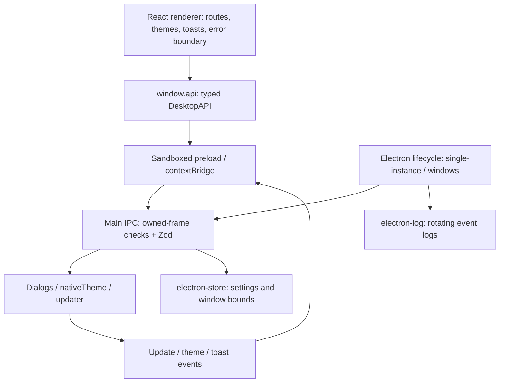

# Architecture layer diagram

```mermaid
flowchart TB
  UI["React renderer: routes, themes, toasts, error boundary"] --> API["window.api: typed DesktopAPI"]
  API --> PRELOAD["Sandboxed preload / contextBridge"]
  PRELOAD --> IPC["Main IPC: owned-frame checks + Zod"]
  IPC --> NATIVE["Dialogs / nativeTheme / updater"]
  IPC --> STORE["electron-store: settings and window bounds"]
  MAIN["Electron lifecycle: single-instance / windows"] --> IPC
  MAIN --> LOG["electron-log: rotating event logs"]
  NATIVE --> EVENTS["Update / theme / toast events"]
  EVENTS --> PRELOAD
```

Renderer code never receives Node.js or raw IPC. Main owns privileged work. The browser test harness replaces only the narrow public API.
