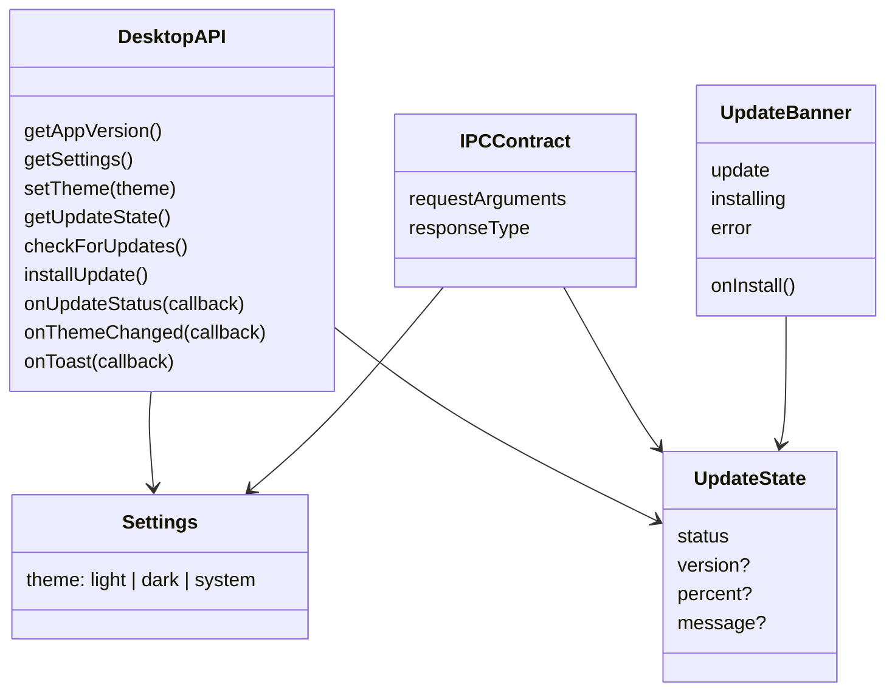

# IPC and UI contracts

```mermaid
classDiagram
  class DesktopAPI {
    getAppVersion()
    getSettings()
    setTheme(theme)
    getUpdateState()
    checkForUpdates()
    installUpdate()
    onUpdateStatus(callback)
    onThemeChanged(callback)
    onToast(callback)
  }
  class IPCContract {
    requestArguments
    responseType
  }
  class Settings {
    theme: light | dark | system
  }
  class UpdateState {
    status
    version?
    percent?
    message?
  }
  class UpdateBanner {
    update
    onInstall()
    installing
    error
  }
  DesktopAPI --> Settings
  DesktopAPI --> UpdateState
  IPCContract --> Settings
  IPCContract --> UpdateState
  UpdateBanner --> UpdateState
```

`UpdateState` is a discriminated union, not a permissive object: each status permits only its own payload.
