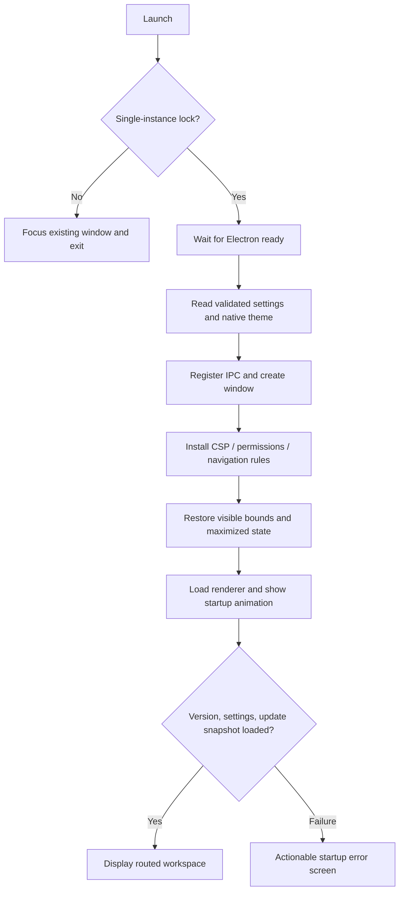

# Startup process flow

```mermaid
flowchart TD
  START["Launch"] --> LOCK{"Single-instance lock?"}
  LOCK -->|No| FOCUS["Focus existing window and exit"]
  LOCK -->|Yes| READY["Wait for Electron ready"]
  READY --> SETTINGS["Read validated settings and native theme"]
  SETTINGS --> IPC["Register IPC and create window"]
  IPC --> CSP["Install CSP / permissions / navigation rules"]
  CSP --> RESTORE["Restore visible bounds and maximized state"]
  RESTORE --> LOAD["Load renderer and show startup animation"]
  LOAD --> INIT{"Version, settings, update snapshot loaded?"}
  INIT -->|Yes| HOME["Display routed workspace"]
  INIT -->|Failure| FALLBACK["Actionable startup error screen"]
```
