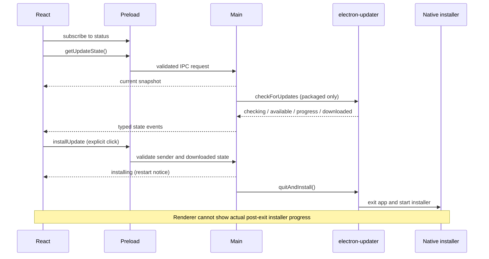

# Update sequence diagram

```mermaid
sequenceDiagram
  participant UI as React
  participant P as Preload
  participant M as Main
  participant U as electron-updater
  participant OS as Native installer
  UI->>P: subscribe to status
  UI->>P: getUpdateState()
  P->>M: validated IPC request
  M-->>UI: current snapshot
  M->>U: checkForUpdates (packaged only)
  U-->>M: checking / available / progress / downloaded
  M-->>UI: typed state events
  UI->>P: installUpdate (explicit click)
  P->>M: validate sender and downloaded state
  M-->>UI: installing (restart notice)
  M->>U: quitAndInstall()
  U->>OS: exit app and start installer
  Note over UI,OS: Renderer cannot show actual post-exit installer progress
```
